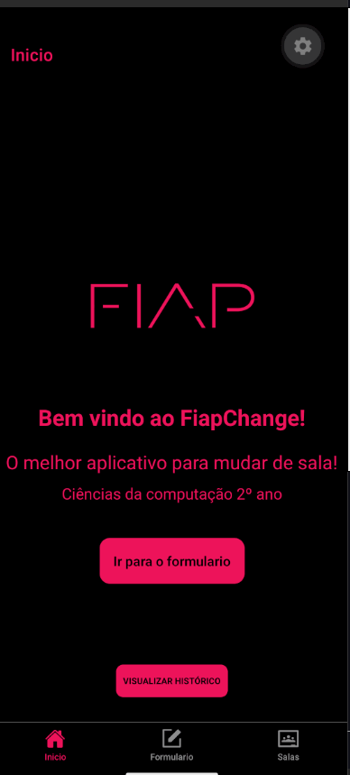
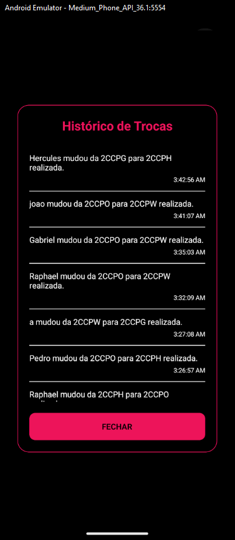

#  Gestão de Mudança de Salas para a FIAP (FiapChange)


## 🎯 Sobre o Projeto
Anteriormente, o processo de solicitação e atualização de mudança de salas na **FIAP** era um processo manual e demorado. Este aplicativo foi desenvolvido para modernizar essa gestão, permitindo que alunos e administradores realizem a troca de ambiente com apenas alguns cliques.

O sistema gerencia em tempo real a disponibilidade de vagas, garantindo que nenhuma sala ultrapasse sua capacidade máxima e mantendo o histórico de motivos da troca.

## 🎓 Funcionalidades
* **Formulário Inteligente:** Cadastro de troca com validação de existência de sala e campo de motivo.
* **Gestão de Vagas (Real-time):** Ao realizar uma troca, o app libera 1 vaga na sala de origem e ocupa 1 vaga na sala de destino.
* **Suporte a Identificadores FIAP:** Aceita salas com nomes alfanuméricos (ex: `2ccpo` e `2ccpw`).
* **Visualização de Status:** Listagem dinâmica com `map` de todas as salas e suas respectivas ocupações.
* **Histórico de Trocas (Modal):** Visualização centralizada de todas as atividades realizadas, acessível via Modal, garantindo uma interface mais limpaS.
* **Cálculo Global de Alunos:** Monitoramento em tempo real do total de alunos matriculados em todas as salas, utilizando funções de agregação (`reduce`) no Contexto.
* **Algoritmo para validação:** Utilização de Math.random para determinar se a mudança de sala será efetuada ou não, com uma chance de 70% de sucesso.

## 🛠️ Tecnologias Utilizadas
* **Framework:** Expo (React Native)
* **Navegação:** Expo Router
* **Gerenciamento de Estado:** React Context API (Provider Pattern)
* **Estilização:** StyleSheet (Design System FIAP: Dark & Pink)


## 🏁 Como Iniciar

### Pré-requisitos
* Node.js instalado.
* Aplicativo **Expo Go** instalado no seu dispositivo móvel.
* Android Studio para simular o celular caso desejado.

### Instalação
1. Clone o repositório:
   ```bash
   git clone https://github.com/Rezenderzd/cp1-react-native.git
2. Instale as dependências:

    ```Bash
    npm install --legacy-peer-deps
    ```
3. Inicie o servidor com limpeza de cache:

    ```Bash
    npx expo start -c
    ```

### 📖 Como Funciona? (Regra de Negócio)
O aplicativo utiliza o Provider para garantir que as atualizações de estado sejam seguras:

1. **Validação:** O sistema busca as salas no AppContext ignorando diferenças entre maiúsculas e minúsculas.

2. **Troca de Vagas:** * adicionarVaga(salaAtual): Soma +1 na sala de onde o aluno saiu.

3. **Rastreabilidade (Logs):** Ao confirmar uma troca, o sistema dispara a função adicionarAoHistorico, gerando um registro imutável com ID único e horário da operação.

4. **Sincronização Global:** Os dados são refletidos instantaneamente na listagem de salas e no Modal de Histórico, sem a necessidade de recarregar o aplicativo.


### 🖼️Gif do projeto em prática (Demonstração)
<p align="center">

</p>

<br> 

### 🐱‍👤📷 Alguns prints para melhor visualização
<p align="center">
  
  
  
  
</p>

### 💡 Decisões Técnicas
#### Estrutura do Projeto: 
* O projeto foi desenvolvido utilizando React Native com Expo Router. A arquitetura foi pensada para separar a lógica de dados da interface, centralizando o estado global em um Context Provider, o que facilita a manutenção e evita a passagem excessiva de props.

#### Hooks Utilizados:
* `useContext`: O principal pilar do app, usado para compartilhar o histórico de trocas e a lista de salas entre todas as telas de forma síncrona.
* `useState`: Utilizado para gerenciar dados locais, como os inputs do formulário e o controle de visibilidade (abrir/fechar) do Modal de histórico.
* `useRouter`: Hook nativo do expo-router utilizado para gerenciar a navegação programática entre as telas (ex: redirecionar após preencher o formulário).

#### Organização da Navegação:
* Utilizamos a navegação baseada em arquivos do Expo Router. A tela principal serve como aba central, enquanto o formulário e a visualização de salas são rotas secundarias. Para o histórico, optamos por um Modal sobreposto na Home.

<br>

### 🚀 Próximos Passos
Pedimos para IA gerar algumas sugestões de melhora para o projeto futuramente.
1. Persistência de Dados Local: Implementação do AsyncStorage para garantir que o histórico de trocas e o estado das salas sejam mantidos mesmo após fechar o aplicativo.

2. Validação de Capacidade: Bloqueio inteligente no formulário para impedir trocas caso a sala de destino já tenha atingido o limite máximo de ocupação.

3. Filtros de Histórico: Adição de funcionalidades para buscar ou filtrar registros específicos dentro do Modal, facilitando a auditoria de trocas.

4. Sistema de Notificações: Avisos em tempo real (Push Notifications) para confirmar o sucesso da operação ou alertar sobre novas vagas disponíveis.

5. Exportação de Logs: Função para exportar o histórico de trocas em formato CSV ou PDF para fins administrativos acadêmicos.

<br>

### 👥 Contribuidores
563415 Fernando Caires Silva

563500 Guilherme Martins Rezende

563567 Raphael Mischiatti de Souza

Desenvolvido para o CP1 - Faculdade de Informática e Administração Paulista (FIAP).
